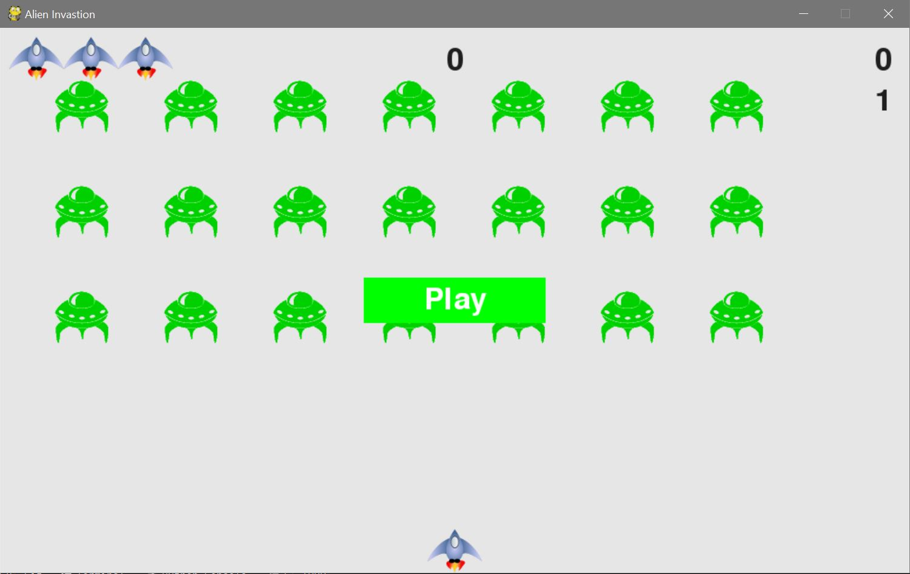
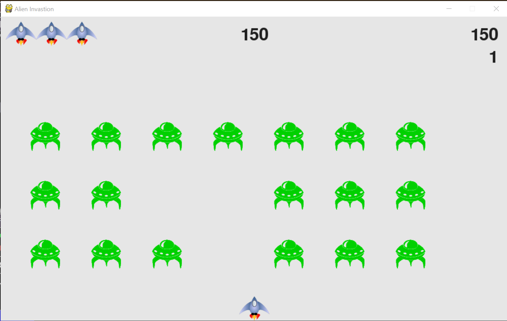

  
  <h1 align="center">Alien Invasion</h1>
  

    This is a Python game project from Python Crash Course.

<!-- ABOUT THE PROJECT -->
## About The Project

### Built With

* Python
* Python - PyGame

<!-- GETTING STARTED -->
## The Process and What I have learned

### The Process

  I started learning Python with Python Crash Course, a great book with lots of tutorials and practices.
  This is a game that you can use the arrow key and space bar to shoot aliens and win points. 

### Lesson Learned

With this game project, I learned the process of writing a program and how different parts work together to make the program running. I learned about writing different functions, using classes, and creating instances. 

  
Working on this project, I encountered numerous errors that were sometimes easy to catch, such as typos and sometimes challenging to understand. I found using the Python debugger ('PDB') very helpful as I could see step by step what was going on. 

